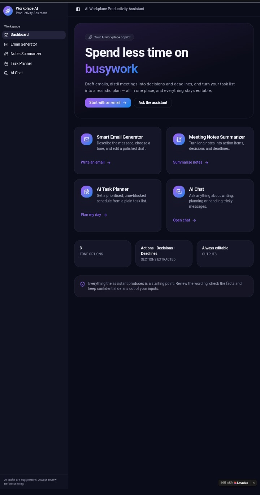
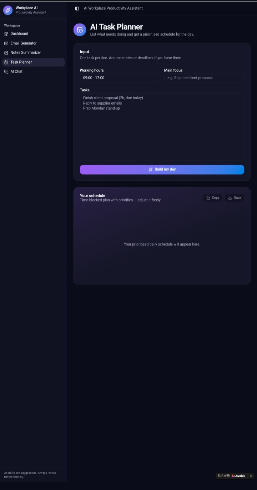
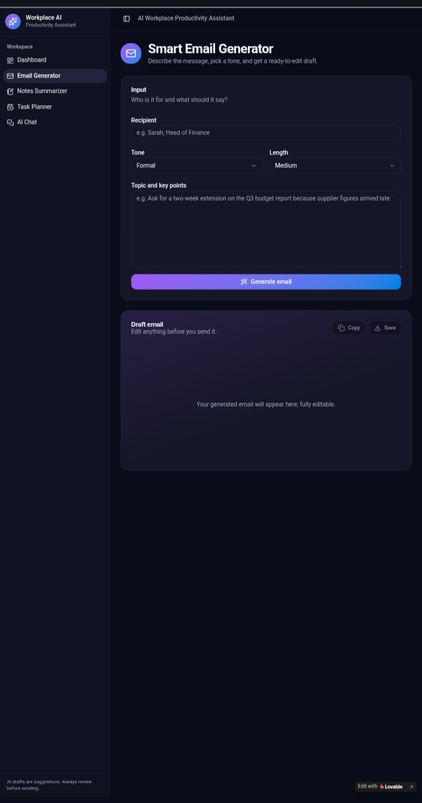

# AI Workplace Productivity Assistant
### By Tebogo Paulina Ntete | CAPACITI JHB Week 18

> Spend less time on busywork - Your AI workplace copilot

**Live Demo:** https://ai-taskflow-buddy.lovable.app
**Lovable Project:** ai-taskflow-buddy.lovable.app

---

### 🚀 Project Overview
A modern, responsive web application that helps professionals automate daily workplace tasks using Artificial Intelligence. This single dashboard integrates multiple AI tools to draft emails, summarize meetings, and plan tasks - all editable and user-controlled.

Built as part of CAPACITI AI-Powered Workplace Productivity Assistant challenge (Deadline: COB Friday).

### ✨ Features (4 Core Tools)

**1. Smart Email Generator**
- Input: Topic, Recipient, Context
- Select Tone: Formal / Friendly / Persuasive
- Output: Editable professional email
- Use Case: Quick client communication

**2. Meeting Notes Summarizer**
- Input: Paste long meeting notes
- AI Output: Summary + Action Items + Decisions + Deadlines
- Editable output

**3. AI Task Planner**
- Input: List of daily tasks
- AI Output: Prioritized realistic daily schedule with time blocks

**4. AI Workplace Assistant Chatbot**
- Chat interface for general workplace questions
- Context-aware responses

### 🛠️ Tools & Technologies Used

- **Lovable AI** - No-code platform to build & publish the app
- **ChatGPT / GPT-4** - Prompt engineering for email, summary, planning
- **GitHub** - Version control & documentation
- **Vercel / Lovable Hosting** - Deployment
- **Frontend:** React, Tailwind CSS, TypeScript
- **Prompt Techniques Used:** Role prompting, structured output, tone control, summarization

### 🧠 AI Prompt Examples

**Email Generator Prompt:**

**Meeting Summarizer Prompt:**

### 🔒 Responsible AI Disclaimer
This tool uses generative AI to assist, not replace, human judgment. Users must:
- Review and edit all AI-generated content before sending
- Not input confidential/sensitive company data
- Verify facts and deadlines
- AI outputs may contain errors - human oversight required
- Complies with workplace AI ethics and data privacy principles

### 📱 Responsive Design
Works on mobile and desktop. Tested on Chrome mobile.

### 📸 Screenshots

| Feature | Screenshot |
| --- | --- |
| **Dashboard - Home Page** |  |
| **Email Generator (3 Tones)** |  |
| **Task Planner & AI Assistant** |  |

> Responsive design tested on mobile and desktop | Chrome mobile verified
### 📝 How to Use
1. Visit https://ai-taskflow-buddy.lovable.app
2. Click "Start with an email" or "Ask the assistant"
3. Enter your inputs and generate
4. Edit output before using

### 👩‍💻 Author
**Tebogo Paulina Ntete**
CAPACITI - AI Cohort JHB Week 18
Thulamela, Limpopo

---
Submitted: September 2026 | COB Friday
